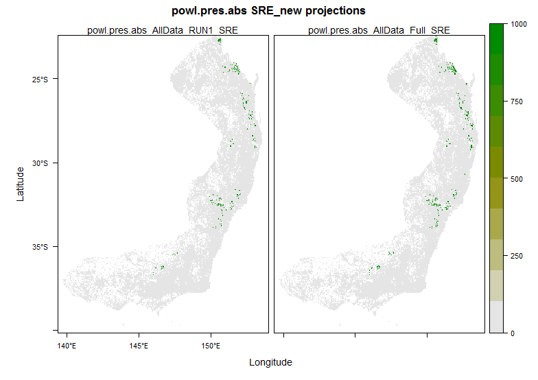

```{r setup, include=FALSE}
knitr::opts_chunk$set(echo = TRUE)
```

# Introduction

## License
This repository is licensed under an MIT license. The hoot detective data set is licensed under a [Creative Commons Attribution 4.0 International License](https://creativecommons.org/licenses/by/4.0/) and is attributed to [QUT Ecoacoustics](https://github.com/QutEcoacoustics) and [Hoot Detective](https://hootdetective.net.au/). 

## Background

This is a simple example workflow for preparing a data set that can be used for species distribution modelling, using ecoacoustic data and annotations from the [Hoot Detective](https://hootdetective.net.au/) project. Hoot Detective is a citizen science project that uses audio from the [Australian Acoustic Observatory (A2O)](https://acousticobservatory.org/). 

The starting hoot detective data set contains annotations of presence or absence for five different owl species, as well as the corresponding audio recording ID and site ID for each presence/absence record. This workflow will demonstrate how two different sets of data can be formatted using these annotations: a presence absence set, and a total call frequency set, and then demonstrate how these can be used to perform Species Distribution Modelling in R. Alternatively, the Hoot Detective data, once prepared, can be used to generate SDMs on the [EcoCommons platform](https://www.ecocommons.org.au/) directly. 

# Packages

```{r packages, warning = FALSE, error=FALSE, message = FALSE}
# options(java.parameters = "-Xmx16000m")
require(renv)
require(tidyr)
require(dplyr)
require(ggplot2)
require(raster)
require(terra)
require(rgeos)
require(rgdal)
require(sf)
require(biomod2)
require(dismo)
require(rJava)
library(tidyterra)
Sys.setenv(JAVA_HOME='C:/Program Files/Java/jre1.8.0_351') # for 64-bit version

#renv::snapshot() # create a snapshot
#renv::restore() # restore the project library locally on machine
```

# Powerful Owl

## Data preparation

### Base layers

Import an AUS boundary vector. 

```{r}
aus_boundary <- vect("data/rasters-float32/AUS_boundary.shp")
```

### Environmental predictors

For this example, we will be using a spatial resolution of 250m. Typically, A2O sensors are positioned at least 500m apart. In this case, a finer spatial scale could be more apprioriate. However, the decision to use 250m was based on the trade-off between capturing some variation between sensors that are close together, without sacrificing the computing time required for the purposes of this example. The spatial resolution you use should depend on your research questions and data. A finer resolution may be necessary, but be aware that processing time can increase dramatically. 

In this example we will be Working with two different raster stacks. For full details on how the layers were downloaded and formatted, see the mentioned script files in the below chunk.  

```{r}
# source("hoot_scripts/pred_download_rasters.R")
# source("hoot_scripts/pred_resample_rasters.R")
# source("hoot_scripts/pred_stack.R")

# import the raster stacks
predictors_stack_1_AUS <- stack("data/rasters-float32-250m/stack_1_powl_full.tif")
predictors_stack_2_AUS <- stack("data/rasters-float32-250m/stack_2_powl_full.tif")
```

### Hoot records

Using the hoot detective data, I'm going to prepare two types of response data sets. The first will be simple presence / absence records for each sensor. The second set will be the total frequency (number) of calls identified for each species, per sensor. See the `"hoot_scripts/hoot_data_import.R` for the full methods. 

#### Presence / absence

```{r import}
# source("hoot_scripts/hoot_data_import.R")

# Here I am reading in a list file containing the prescence absence data for each of the five species. This list object was generated in "hoot_scripts/hoot_data_import.R"
hoot_data <- readRDS(file = "output/hoot_list/hoot_pres_abs.rds")
```

If you are dealing with a species that has a limited distribution, it would be a good idea to first make sure that there are no anomalous records. Such as for the Powerful Owl. I'll plot only the presence data for Powerful Owl:

```{r}
hoot_data$powl %>% filter(pres == 1) %>% 
        ggplot() + 
        geom_point(colour = "red", aes(x = lon, y = lat)) +
        geom_spatvector(data = aus_boundary,
                        fill = NA)
```

It looks like there is a presence in Western Australia. This is quite far outside of the known distribution, which you could check on Atlas of Living Australia. It would be good practice to go back to the annotation record, and the associated audio file (available on A2O) to check. But for this example I will demonstrate a workflow to crop points that fall outside of a known distribution, as well as your raster stack. 

Here I am reading in the final presence absence data set for Powerful Owl which has now been filtered to remove the anomalous point, as well as the cropped raster stacks. See the specified `.R` scripts for the full methods on how these were generated. 

```{r}
#source("hoot_scripts/powl_apply_boundary_points.R")
        powl_occ_cropped <- read.csv(file = "output/filtered_data/powl_pres_abs_cropped.csv")

#source("hoot_scripts/powl_apply_boundary_raster.R")
        predictors_stack_1_crop <- stack("data/rasters-float32-250m/stack_1_powl_boundary.tif")
        predictors_stack_2_crop <- stack("data/rasters-float32-250m/stack_2_powl_boundary.tif")
```


#### Frequency of calls

I'm going to read in the frequency of calls set for Powerful Owl. Check `hoot_scripts/hoot_data_import.R` for the full details on how to generate this set, for each of the species.

```{r}
# read in all species:
frequency_all <- readRDS("output/hoot_list/hoot_frequency_list_object.rds")

# read in the filtered powerful owl set:
powl_calls_freq <- read.csv("output/filtered_data/powl_freq.csv")
```


## SDM

Now that the data is prepared, we can start running some Species Distribution Models with a range of different methods. To recap, the two main owl response sets we will use are:

 - Presence/absence data = `powl_occ_cropped`
 - Frequency data = `powl_calls_freq`

### SRE

Will start by running a Surface Range Envelope (SRE), using the `biomod2` package. 

```{r eval = FALSE}
# set some model options
myBiomodOptions <- BIOMOD_ModelingOptions()
biomod_eval_method <- c("KAPPA", "TSS", "ROC", "FAR", "SR", "ACCURACY", "BIAS",
                       "POD", "CSI", "ETS")

# format as spatial point data frame
powl_occ_cropped_df <- powl_occ_cropped
coordinates(powl_occ_cropped_df) <- ~coords.x1+coords.x2

# format the data using biomod
bio_mod_pres_abs_V1 <- BIOMOD_FormatingData(
        resp.name = "powl.pres.abs",
        resp.var = powl_occ_cropped_df,
        expl.var = predictors_stack_1_crop,
        dir.name = "output/sre",
        na.rm = TRUE, 
        PA.nb.rep = 0
)

# run the model
bio_mod_out <- BIOMOD_Modeling(
                      bm.format = bio_mod_pres_abs_V1,
                      modeling.id = 'SRE_pres_abs_V1',
                      models = c('SRE'),
                      bm.options = myBiomodOptions,
                      nb.rep = 1,
                      data.split.perc = 80,
                      metric.eval = biomod_eval_method,
                      var.import = 2,
                      do.full.models = TRUE,
                      seed.val = 1,
                      save.output = TRUE
                                      
)

# project over our cropped raster stack
bio_mod_out_proj <- BIOMOD_Projection(bm.mod = bio_mod_out,
                                    proj.name = 'SRE_new',
                                    new.env = predictors_stack_1_crop,
                                    models.chosen = 'all',
                                    metric.binary = 'all',
                                    metric.filter = 'all',
                                    build.clamping.mask = TRUE)

test <- BIOMOD_LoadModels("output/sre/powl.pres.abs/proj_SRE_new/powl.pres.abs.SRE_new.projection.out")

plot(bio_mod_out_proj)
```



### MaxEnt

Next we will run a MaxEnt model. 

Let's check if the `maxent.jar` is available. I've placed the MaxEnt folder within my working directory (`/java/maxent.jar`). 

```{r}
jar <- paste(system.file(package = "dismo"), "/java/maxent.jar", sep = '') 

if (file.exists(jar)) {
        cat("can continue, maxent is available")
} else {
        cat('cannot run this because maxent is not available')
}
```

Prepare presence only data:

```{r}
powl_occ_cropped_pres <- 
        powl_occ_cropped %>%
        dplyr::filter(pres == 1)
```

Set some model arguments:

```{r eval = FALSE}
maxent_args <-
        c('removeduplicates=TRUE',
          'jackknife=TRUE',
          'responsecurves=TRUE',
          'plots=TRUE')
```

Run the MaxEnt model using `raster stack 1`. The output is saved in the `path` specified.

```{r eval = FALSE}
powl_maxent_stack1 <-
        dismo::maxent(
                predictors_stack_1_crop,
                powl_occ_cropped_pres[2:3],
                path = "output/maxent/powl_maxent_stack1",
                args = maxent_args
        )
```

Let's predict over our raster stack and plot the result. Here we could predict using a different spatial extent, such as the entire of Australia. I'll just use the cropped raster for the known distribution of Powerful Owl.  

```{r eval = FALSE}
# use the predict function
powl_maxent_stack1_prediction <- predict(powl_maxent_stack1, 
                                         predictors_stack_1_crop, 
                                         args = maxent_args)

# plot the result and export as .png

# open the png device with the path where you would like to save the plot
png("output/maxent/figures/baseplot_powl_maxent_stack1_prediction.png") 

        # plot the prediction raster:
        plot(powl_maxent_stack1_prediction)

        # add the presence points:
        points(powl_occ_cropped_pres[2:3], pch=20, cex=1, col = "blue")

        # add the aus boundary vector for some context:
        lines(aus_boundary)
        
# close the png device
dev.off()

# export the prediction layer as a raster (tif)
writeRaster(powl_maxent_stack1_prediction, 
            file = "output/maxent/powl_maxent_stack1/powl_maxent_stack1_prediction.tif")
```


I am also going to plot the prediction using the `tidyterra` package, and save the resulting figure. This package provides some helpful wrapper functions and geoms for plotting objects using `ggplot2.`

```{r eval = FALSE}
# convert prediction to SpatRaster 
powl_maxent_stack1_prediction <- terra::rast(powl_maxent_stack1_prediction)

# extract the x and y limits of the prediction layer
lims <- ext(powl_maxent_stack1_prediction)

# create the plot
ggplot() +
        geom_spatraster(data = powl_maxent_stack1_prediction) +
        scale_fill_whitebox_c( # scale_*_whitebox_c(): for continuous values
                palette = "pi_y_g") +
        labs(fill = "Predicted Environmental Suitability") +
        geom_spatvector(data = aus_boundary,
                        fill = NA,
                        show.legend = FALSE,
                        inherit.aes = TRUE) +
        ggplot2::geom_point(data = powl_occ_cropped_pres,
                            colour = "blue", size = 3, shape = 21,
                            aes(x = coords.x1, 
                                y = coords.x2), 
                            show.legend = FALSE) +
        guides(size = guide_legend(title = "Presence")) +
        theme(legend.position = "bottom") +
        coord_sf(xlim = lims[1:2], ylim = lims[3:4]) +
        xlab("Longitude ") +
        ylab("Latitude")

# call ggsave
ggsave(filename = "output/maxent/figures/gg_powl_maxent_stack1_prediction.png")
```


Let's repeat this process using `raster stack 2` to compare the results. 

```{r eval = FALSE}
powl_maxent_stack2 <-
        dismo::maxent(
                predictors_stack_2_crop,
                powl_occ_cropped_pres[2:3],
                path = "output/maxent/powl_maxent_stack2",
                args = maxent_args
        )
```

```{r eval = FALSE}
powl_maxent_stack2_prediction <- predict(powl_maxent_stack2,
                                         predictors_stack_2_crop,
                                         args = maxent_args)
                                        #filename = "plot.tif")

writeRaster(powl_maxent_stack2_prediction, 
            file = "output/maxent/powl_maxent_stack2/powl_maxent_stack2_prediction.tif")

# create the plot
powl_maxent_stack2_prediction <- rast(powl_maxent_stack2_prediction)
ggplot() +
        geom_spatraster(data = powl_maxent_stack2_prediction) +
        scale_fill_whitebox_c( # scale_*_whitebox_c(): for continuous values
                palette = "pi_y_g") +
        labs(fill = "Predicted Environmental Suitability") +
        geom_spatvector(data = aus_boundary,
                        fill = NA,
                        show.legend = FALSE,
                        inherit.aes = TRUE) +
        ggplot2::geom_point(data = powl_occ_cropped_pres,
                            colour = "blue", size = 3, shape = 21,
                            aes(x = coords.x1, 
                                y = coords.x2), 
                            show.legend = FALSE) +
        guides(size = guide_legend(title = "Presence")) +
        theme(legend.position = "bottom") +
        coord_sf(xlim = lims[1:2], ylim = lims[3:4]) +
        xlab("Longitude ") +
        ylab("Latitude")
# call ggsave
ggsave(filename = "output/maxent/figures/gg_powl_maxent_stack2_prediction.png")
```


### BRT

#### Call frequency

Now I'm going to run a Boosted Regression Tree (BRT) using the call frequency data set.

Start by preparing the data for input into the `gbm.step` function provided by the `dismo` package:

```{r eval = FALSE}
# prepare the response variable data
# convert to SF / SPDF and extract from raster stack
powl_calls_freq_SF <- st_as_sf(
        x = powl_calls_freq,
        coords = c("coords.x1", "coords.x2"),
        crs = "epsg:4326"
)

powl_calls_freq_SP <- as_Spatial(powl_calls_freq_SF)

# stack 1: cropped
powl_calls_freq_pred_stack_1_crop <-
        terra::extract(predictors_stack_1_crop, powl_calls_freq_SP)

powl_calls_freq_pred_stack_1_crop_df <-
        cbind(powl_calls_freq_2, powl_calls_freq_pred_stack_1_crop)

# stack 2: cropped
powl_calls_freq_pred_stack_2_crop <-
        terra::extract(predictors_stack_2_crop, powl_calls_freq_SP)

powl_calls_freq_pred_stack_2_crop_df <-
        cbind(powl_calls_freq_2, powl_calls_freq_pred_stack_2_crop)
```

Run a BRT:

```{r eval = FALSE}
names(powl_calls_freq_pred_stack_1_crop_df)
names(powl_calls_freq_pred_stack_2_crop_df)

# stack 1: cropped
powl_brt_stack1_crop_v1 <-
        gbm.step(
                data = powl_calls_freq_pred_stack_1_crop_df,
                gbm.x = c(6:10),
                gbm.y = 5,
                family = "poisson",
                tree.complexity = 3,
                learning.rate = 0.01,
                bag.fraction = 2
        ) #nTrain = 5)


summary(powl_brt_stack1_crop_v1)

# Predict over the raster stack, write to raster
powl_brt_stack1_crop_v1_pred <-
        predict(predictors_stack_1_crop, powl_brt_stack1_crop_v1, type = "response")

writeRaster(powl_brt_stack1_crop_v1_pred, file = "output/brt/powl_brt_stack1_crop_v1_pred.tif")
```

```{r}
# plot the results
powl_brt_stack1_crop_v1_pred <- terra::rast(x = "output/brt/powl_brt_stack1_crop_v1_pred.tif") 

plot(powl_brt_stack1_crop_v1_pred)
```

Repeat the process for stack 2: 

```{r eval = FALSE}
# Stack 2: cropped
powl_brt_stack2_crop_v1 <-
        gbm.step(
                data = powl_calls_freq_pred_stack_2_crop_df,
                gbm.x = c(6:11),
                gbm.y = 5,
                family = "poisson",
                tree.complexity = 3,
                learning.rate = 0.03,
                bag.fraction = 2
        ) #nTrain = 5)


summary(powl_brt_stack2_crop_v1)

# Predict over the raster stack and save
powl_brt_stack2_crop_v1_pred <-
        predict(predictors_stack_2_crop, powl_brt_stack2_crop_v1, type = "response")

writeRaster(powl_brt_stack2_crop_v1_pred, file = "output/brt/powl_brt_stack2_crop_v1_pred.tif")
```

```{r}
# now we can plot the results
powl_brt_stack2_crop_v1_pred <- terra::rast(x = "output/brt/powl_brt_stack2_crop_v1_pred.tif") 
plot(powl_brt_stack2_crop_v1_pred)

# Add the points if you like:
p <- st_as_sf(powl_occ_cropped, coords = c("coords.x1", "coords.x2"))
q <- as_Spatial(p)
points(q)
```

